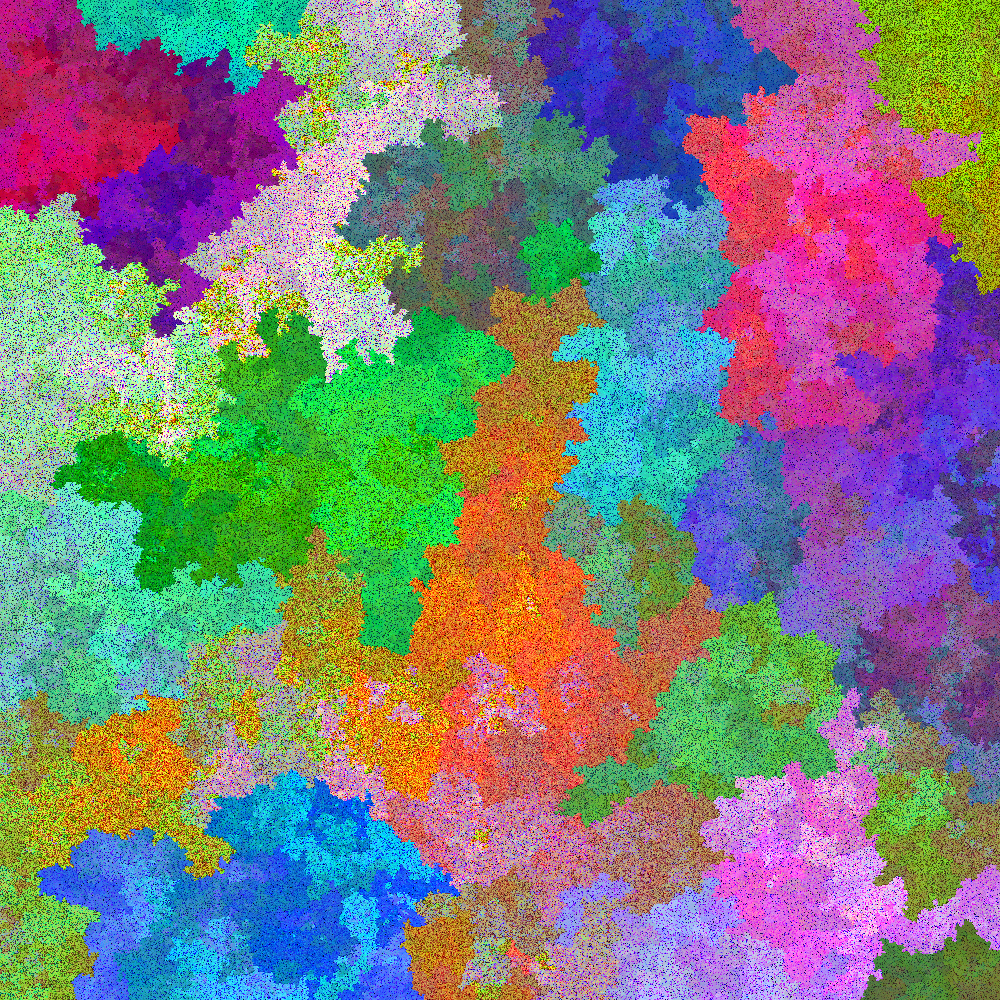

# Dual-colors

The dual algorithms to my first programmatic artwork, [colors](https://github.com/isaacg1/colors).

Colors, the previous program/artwork, works as follows:
1. Pick a random color
2. Find the most similar color already placed.
3. Find the location of that color
4. Find the nearest empty location
5. Put that color in that location.

This program does the dual:
1. Pick a random location
2. Find the closest location already placed.
3. Find the color in that location.
4. Find the nearest unused color
5. Put that color in that location

Colors created expanding circles in location-space, accompanied by irregular spikes in color-space.
Where the location-circles met, there was a smooth flow across the remainder of location-space,
with all of the remaining colors crammed together.

This program creates expanding spheres in color-space, accompanied by irregular spikes in location-space.
Where the color-spheres meet, there is a smooth flow across the remainder of color-space,
with all of the remaining locations selected haphazardly.
